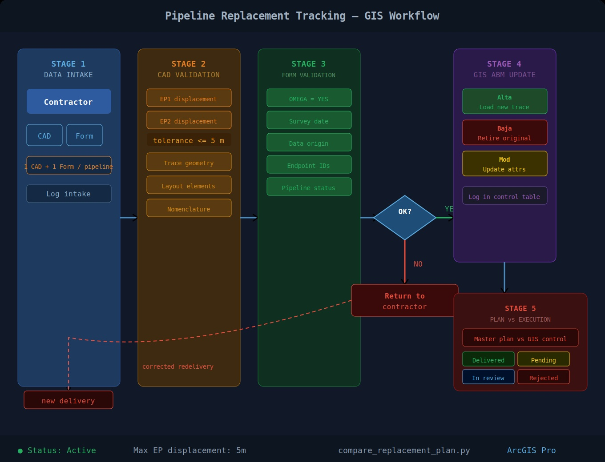
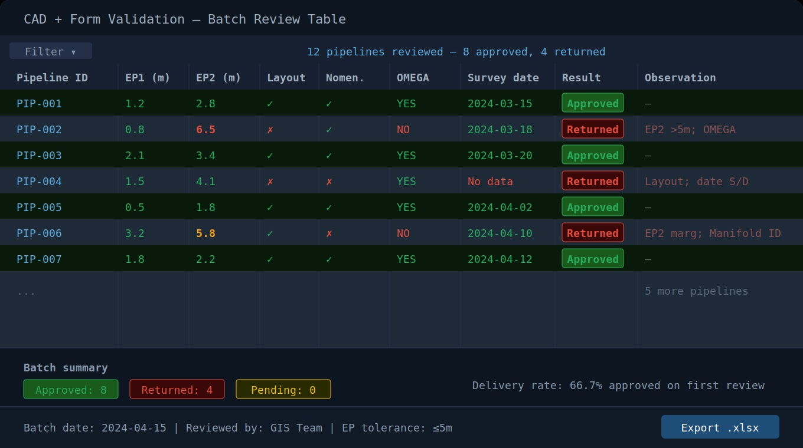

# 🛢️ Pipeline Replacement Tracking — GIS

<p align="center">
  
  
  
  
  
</p>

<p align="center">
End-to-end GIS workflow for pipeline replacement tracking —<br>
CAD intake, spatial validation, form QA/QC, ABM operations and replacement plan monitoring.
</p>

---

## 📌 Project Description

This project covers the full lifecycle of pipeline replacement data management in GIS:
from receiving CAD survey files and field forms submitted by contractors,
through spatial and attribute validation, up to the final GIS update (ABM)
and comparison against the replacement master plan.

The workflow ensures that every pipeline replacement is correctly modeled,
validated against precision standards, properly attributed, and traceable
in the GIS system.

---

## 🔄 Workflow Overview

<p align="center">
  
</p>

---

## 📋 Validation Results — CAD & Forms QC

Structured review of CAD files and field survey forms, showing detected inconsistencies,
endpoint displacement analysis and corrective actions.

<p align="center">
  
</p>

---

## 🗂️ Data Sources

| Source | Format | Description |
|---|---|---|
| Field survey CAD | `.dwg` | Pipeline trace with vertices, endpoints and layout elements |
| Field survey forms | `.xlsx` | Attribute data collected by contractors in the field |
| Replacement master plan | `.xlsx` | Planned pipeline replacements for the period |
| GIS replacement control | `.xlsx` | Actual replacement progress tracked in GIS |

---

## ✅ CAD Validation Checklist

Every CAD file received from contractors is reviewed against the following requirements:

### Geometry

| Check | Requirement | Tolerance |
|---|---|---|
| Endpoint 1 displacement | Coordinates match GIS reference | ≤ 5 m |
| Endpoint 2 displacement | Coordinates match GIS reference | ≤ 5 m |
| Vertex intervals | Consistent spacing along trace | Defined per standard |
| Trace geometry | No self-intersections, no zero-length segments | — |
| Pipeline ID | Matches GIS database nomenclature | Exact match |

### Layout elements (mandatory in every CAD file)

- [ ] Title block — project name, company, date, survey date
- [ ] Legend with referenced symbology
- [ ] Coordinate system specification
- [ ] Endpoint coordinate labels (Endpoint 1 and Endpoint 2)
- [ ] Progressive distance labels (partial replacements)

---

## 📝 Form Validation

Field survey forms are reviewed against these attribute requirements:

| Field | Rule | Common Issue |
|---|---|---|
| `Pipeline_ID` | Must match GIS database ID | Incorrect manifold ID |
| `Replacement_Type` | Total / Partial | Mismatch with CAD |
| `OMEGA_Integration` | `YES` for total replacements | Often incorrectly set to `NO` |
| `Survey_Date` | Mandatory — date surveyed by GPS in field | Left as "No data" |
| `Data_Origin` | `Survey` when survey date is present | Set as `Schematic` instead |
| `Endpoint_1_ID` | Must match connected facility in GIS | Wrong manifold ID |
| `Endpoint_2_ID` | Must match connected facility in GIS | Wrong manifold ID |
| `Pipeline_Status` | `Definitive` for surveyed replacements | Set as `Active without CAO` |

---

## ⚙️ Workflow Steps

```text
STAGE 1 — DATA INTAKE
Contractor delivers CAD (.dwg) + Form (.xlsx)
per pipeline replacement (one file per pipeline)
        │
        ▼
STAGE 2 — CAD SPATIAL VALIDATION
├── Endpoint displacement check (tolerance ≤ 5m)
├── Vertex interval consistency
├── Trace geometry integrity
├── Layout elements completeness
└── Pipeline ID vs GIS database cross-check
        │
        ▼
STAGE 3 — FORM ATTRIBUTE VALIDATION
├── OMEGA integration flag
├── Survey date completeness
├── Data origin classification
├── Endpoint IDs vs GIS facilities
└── Pipeline status classification
        │
        ▼
STAGE 4 — OBSERVATION REPORT
├── Inconsistency table per pipeline
├── Return to contractor for correction (if needed)
└── Approval for GIS loading
        │
        ▼
STAGE 5 — GIS ABM UPDATE
├── Alta (new pipeline): load replacement trace + attributes
├── Baja (retired pipeline): update status of replaced pipeline
└── Modificación: update attributes of existing records
        │
        ▼
STAGE 6 — PLAN vs EXECUTION COMPARISON
├── Cross-reference master plan vs GIS control table
├── Flag delivered / pending / rejected pipelines
└── Progress report for project follow-up
```

---

## 🔌 ABM Operations in GIS

| Operation | Trigger | GIS Action |
|---|---|---|
| **Alta** | New replacement pipeline approved | Load trace + attributes into GIS |
| **Baja** | Original pipeline retired | Update status field to `Retired` |
| **Modificación** | Attribute correction after review | Update specific fields in GIS record |

---

## 📊 Plan vs Execution Comparison

The script [`scripts/compare_replacement_plan.py`](scripts/compare_replacement_plan.py)
automates the cross-reference between the replacement master plan and the GIS control table:

- Matches pipelines by ID between both sources
- Flags status: `Delivered` / `Pending` / `Rejected` / `In review`
- Calculates delivery rate per batch
- Exports comparison report to `.xlsx`

---

## 🛠️ Tech Stack

| Tool | Usage |
|---|---|
| **ArcGIS Pro** | Spatial validation, GIS update (ABM), displacement measurement |
| **AutoCAD** | CAD file review — geometry, layout, endpoints |
| **arcpy (Python)** | Automation of spatial checks and GIS loading |
| **Excel** | Form validation, plan vs execution comparison |
| **Power BI** | Replacement progress dashboards |

---

## 📁 Repository Structure

```
gis-pipeline-replacement-tracking/
│
├── README.md
├── .gitignore
│
├── assets/
│   └── screenshots/
│       ├── 01-pipeline-workflow.jpg
│       └── 02-validation-table.jpg
│
├── diagrams/
│   └── pipeline-replacement-workflow.drawio
│
├── docs/
│   ├── cad-validation-checklist.md
│   └── workflow-intake-validation.md
│
└── scripts/
    └── compare_replacement_plan.py
```

---

## 🧠 Key Learnings

- Designing end-to-end data intake workflows for contractor-delivered spatial data
- Applying precision tolerance standards to spatial validation (≤ 5m endpoint displacement)
- Coordinating attribute consistency between CAD, field forms and GIS database
- Managing ABM operations ensuring traceability of replacements in GIS
- Building comparison logic between planned and executed replacement data

---

## 👩‍💻 Author

**Denise Hernández**  
GIS Analyst | Spatial Data | Network Analysis  
[](https://www.linkedin.com/in/denise-hern%C3%A1ndez-a3071968/)
[](https://quickest-stream-2d8.notion.site/Portafolio-GIS-Denise-Hern%C3%A1ndez-3069dd2d2c5781cd9539e5bdc0ba14fe?pvs=74)
